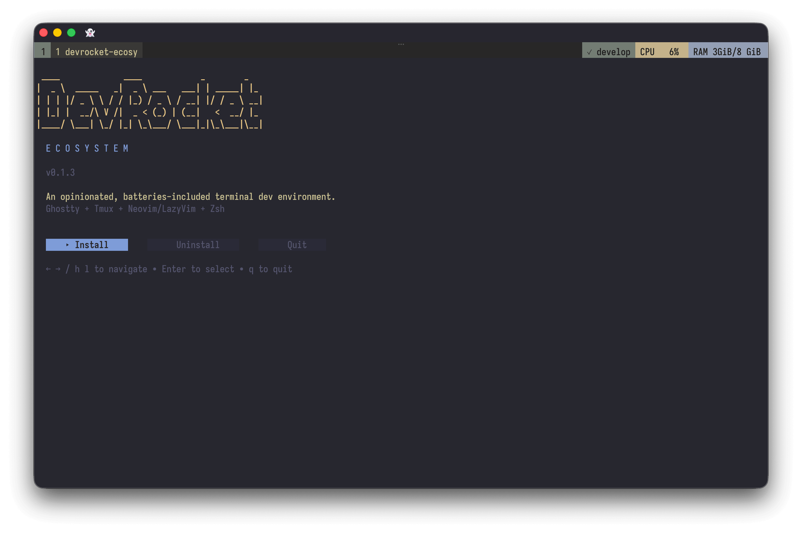
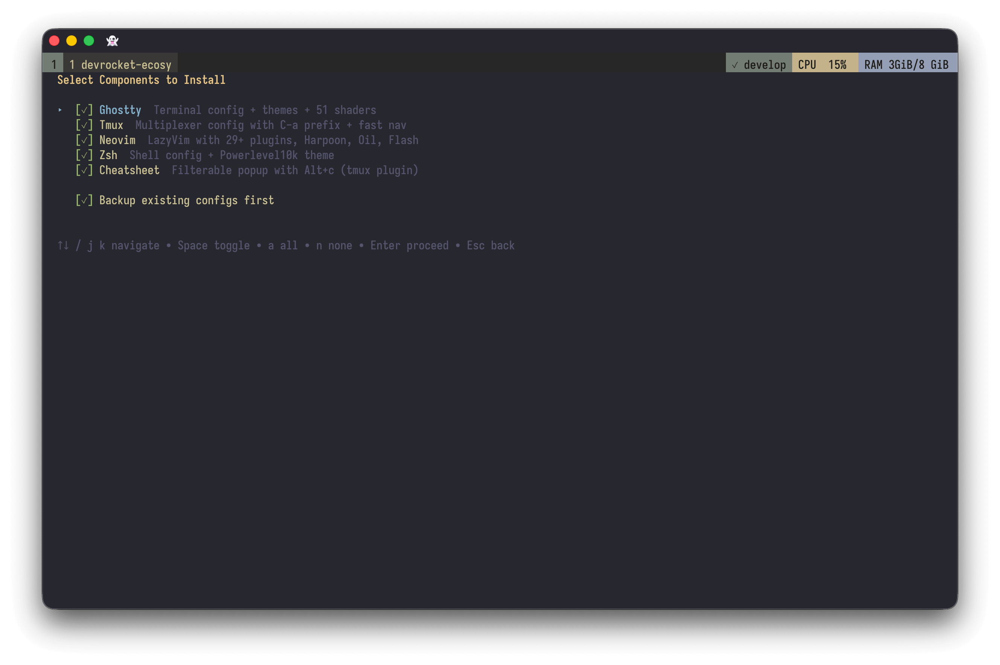
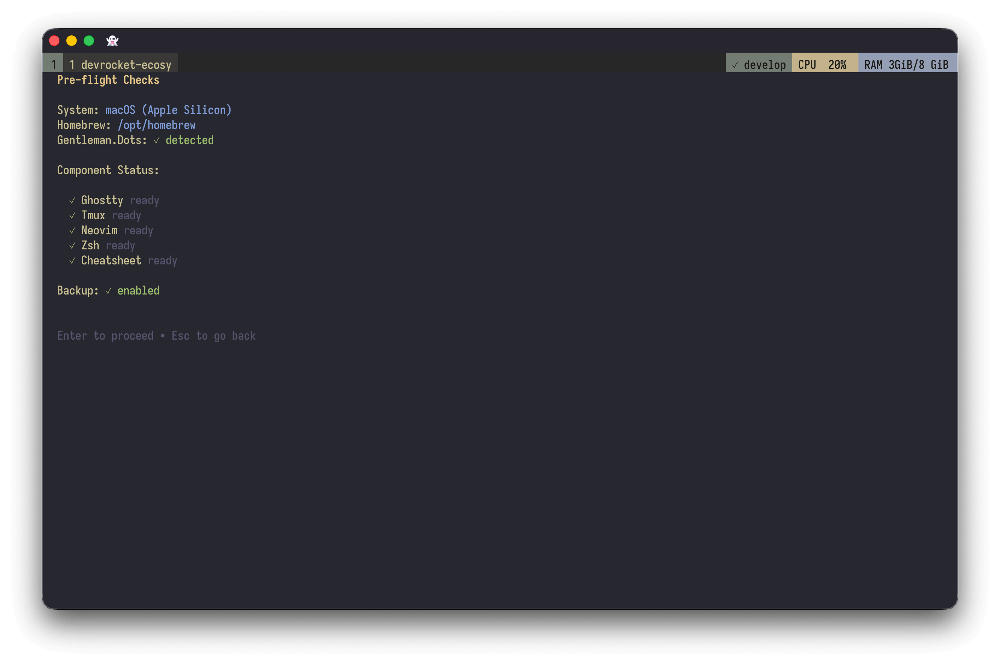
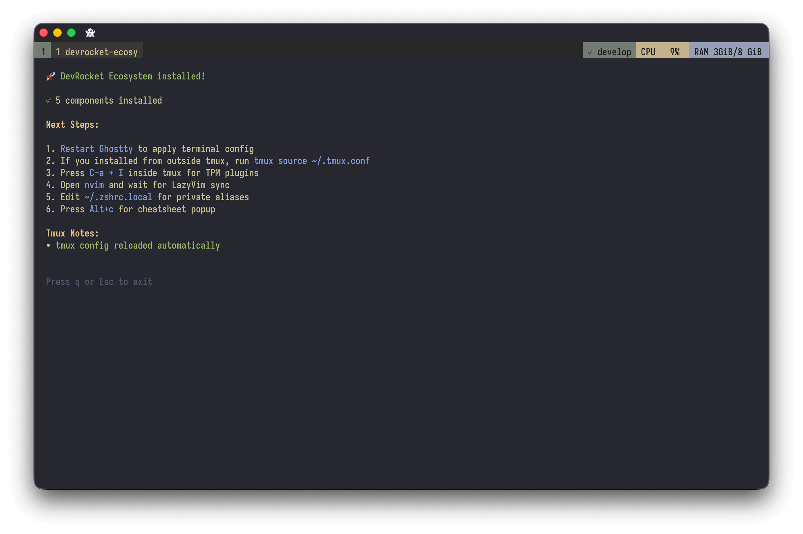
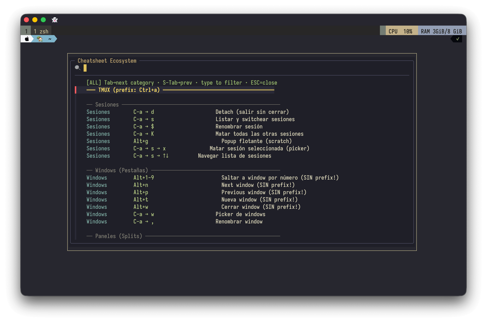

# 🚀 DevRocket Ecosystem

> An opinionated, batteries-included terminal development environment.  
> Ghostty + Tmux + Neovim (LazyVim) + Zsh — configured to work together seamlessly.



## 👀 Preview

### TUI Installer

| Welcome                                     | Component Selection                              |
| ------------------------------------------- | ------------------------------------------------ |
|  |  |

| Pre-flight Checks                              | Installation Result                              |
| ---------------------------------------------- | ------------------------------------------------ |
|  |  |

### Cheatsheet Popup



## ✨ What's Inside

| Tool           | Config               | Highlights                                                      |
| -------------- | -------------------- | --------------------------------------------------------------- |
| **Ghostty**    | Terminal emulator    | Kanagawa theme, custom shaders, optimized keybindings           |
| **Tmux**       | Terminal multiplexer | Prefix `C-a`, seamless navigation with Neovim, popup cheatsheet |
| **Neovim**     | Editor (LazyVim)     | 29+ plugins, Harpoon2, Oil.nvim, Flash.nvim, LSP                |
| **Zsh**        | Shell                | Powerlevel10k, autocomplete, syntax highlighting, zoxide         |
| **Atuin**      | Shell history        | Search, sync v2 baseline, shell workflow recall                  |
| **Cheatsheet** | Tmux popup           | Filterable keybinding reference from tmux prefix workflows      |

## 🏗️ Architecture

| Layer       | Tool                 | Responsibility                                |
| ----------- | -------------------- | --------------------------------------------- |
| **Layer 1** | Ghostty              | Terminal emulator, OS input, visual rendering |
| **Layer 2** | Tmux                 | Sessions, windows, panes, popup workflows     |
| **Layer 3** | Zsh + Neovim/LazyVim | Shell, editing, navigation, coding workflow   |

Each keystroke flows **down** through these layers. If Ghostty captures it, Tmux never sees it. If Tmux captures it, Neovim never sees it. Understanding that interaction saves a lot of debugging time.

## 📋 Prerequisites

This project is a **config overlay** - it assumes you already have the tools installed.

Initial Linux support is included for the installer, tmux clipboard integration, shell config, and the release installer path below. macOS remains the primary target, but Linux should now work with minimal extra setup.

### Recommended: Install via [Gentleman.Dots](https://github.com/Gentleman-Programming/Gentleman.Dots)

This project exists because **Gentleman.Dots** already solves the hard part: setting up a serious terminal environment with the right tools, dependencies, and base conventions.

**DevRocket Ecosystem is intentionally an overlay on top of Gentleman.Dots**, not a replacement.

What Gentleman.Dots gives you:

- a polished bootstrap experience for the core toolchain
- the foundational terminal/dev setup this project builds on
- the conventions and ecosystem this repo extends with a more opinionated personal workflow

What DevRocket Ecosystem adds on top:

- the Go TUI installer experience
- the integrated Ghostty + Tmux + LazyVim workflow
- the popup cheatsheet system and daily keybinding ergonomics
- the opinionated UX details and personal workflow layering

```bash
brew tap Gentleman-Programming/homebrew-tap
brew install gentleman-dots
gentleman-dots
```

### Required Tools

| Tool                                            | macOS / Homebrew               | Linux                                                             |
| ----------------------------------------------- | ------------------------------ | ----------------------------------------------------------------- |
| [Ghostty](https://ghostty.org)                  | Download from website          | Download from website or install with your distro package manager |
| [Tmux](https://github.com/tmux/tmux)            | `brew install tmux`            | Install with your distro package manager                          |
| [Neovim](https://neovim.io)                     | `brew install neovim`          | Install with your distro package manager                          |
| [fzf](https://github.com/junegunn/fzf)          | `brew install fzf`             | Install with your distro package manager                          |
| [Zsh](https://www.zsh.org)                      | Usually pre-installed on macOS | Usually available via your distro package manager                 |
| [fd](https://github.com/sharkdp/fd)             | `brew install fd`              | Install with your distro package manager                          |
| [bat](https://github.com/sharkdp/bat)           | `brew install bat`             | Install with your distro package manager                          |
| [zoxide](https://github.com/ajeetdsouza/zoxide) | `brew install zoxide`          | Install with your distro package manager                          |
| [Atuin](https://atuin.sh)                       | `brew install atuin`           | Install with your distro package manager                          |

### Linux notes

- Recommended Linux flow: use [Gentleman.Dots](https://github.com/Gentleman-Programming/Gentleman.Dots) as the base environment first, then run `dr-sys` to apply this repo as an overlay on top.
- If you do not want to use Gentleman.Dots, install the required tools manually first, then run `dr-sys` to apply this repo's config overlay.
- Install the required tools with your distro package manager or Linuxbrew/Homebrew before running the installer.
- Install a clipboard helper for tmux copy-mode: `wl-clipboard` on Wayland, or `xclip` / `xsel` on X11.
- Make sure `~/.local/bin` is on your `PATH` if you want the installer to place `tmux-cheatsheet` there on Linux.
- Linuxbrew/Homebrew is optional; if it is installed and detected, the installer will reuse its `bin` directory.
- The official Linux `install.sh` below installs only the `dr-sys` release binary. It does not install Ghostty, tmux, Neovim, or other system dependencies for you.

## 🚀 Installation

### Linux: official install.sh

Recommended on Linux after your base tools are already in place. This downloads the matching `dr-sys` release archive from GitHub Releases and installs only the `dr-sys` binary into `~/.local/bin` by default. It does not install system dependencies for you.

```bash
curl -fsSL https://raw.githubusercontent.com/IsaiasUziel/devrocket-ecosystem/master/install.sh | sh
```

Optional overrides:

```bash
curl -fsSL https://raw.githubusercontent.com/IsaiasUziel/devrocket-ecosystem/master/install.sh | VERSION=v0.1.0 INSTALL_DIR="$HOME/bin" sh
```

### Homebrew (recommended on macOS)

```bash
brew tap IsaiasUziel/devrocket-ecosystem
brew install devrocket-ecosystem
```

### Run the installer

```bash
dr-sys
```

### From Source

```bash
git clone https://github.com/IsaiasUziel/devrocket-ecosystem.git
cd devrocket-ecosystem
make build
./bin/dr-sys
```

## 🚀 Release Automation

Releases are automated with GitHub Actions.

- Pushing a tag like `v0.1.9` triggers GoReleaser.
- GoReleaser publishes GitHub release assets for macOS/Linux.
- The Homebrew cask in `IsaiasUziel/homebrew-devrocket-ecosystem` is updated automatically.
- A validation workflow can install the published cask and verify `dr-sys --help` plus `brew audit`.

### Required GitHub Secret

- `TAP_GITHUB_TOKEN` — personal access token with permission to update:
  - `IsaiasUziel/devrocket-ecosystem`
  - `IsaiasUziel/homebrew-devrocket-ecosystem`

### Recommended token scope

- Fine-grained token scoped only to those two repositories
- Repository contents: read/write
- Metadata: read

The TUI installer will:

1. ✅ Detect your OS and install prefix
2. ✅ Check for installed tools (skips configs for missing tools)
3. ✅ Backup your existing configs to `~/.devrocket-backup/`
4. ✅ Copy configs from the embedded binary to your config locations
5. ✅ Bootstrap local Neovim tool dependencies from `configs/nvim/.tools/*` when manifests are present
6. ✅ Install a baseline Atuin config when Atuin is available
7. ✅ Create `~/.zshrc.local` for your private aliases
8. ✅ Ask before replacing an existing `~/.zshrc.local`

## 🧭 Installation Flow

1. **Launch the TUI** — choose `Install`, `Uninstall`, or `Quit`
2. **Select components** — Ghostty, Tmux, Neovim, Zsh, Atuin, Cheatsheet
3. **Run pre-flight checks** - tool detection, OS info, install prefix, backup status
4. **Install with feedback** — per-component progress and success/warn/error summary

### After installing:

1. **Restart Ghostty** to apply terminal config
2. Run `tmux source ~/.tmux.conf` to reload tmux
3. Press `C-a + I` inside tmux to install TPM plugins
4. Open `nvim` and wait for LazyVim to sync plugins
5. Edit `~/.zshrc.local` for your private aliases (passwords, SSH, etc.)

> Note: if a Neovim config ships local tool manifests under `configs/nvim/.tools/` (for example `blade-formatter`), the installer will try to run `npm ci` or `npm install` automatically in those tool directories after copying the config.

> If you already had a `~/.zshrc.local`, the installer now lets you keep it as-is or replace it explicitly. It will not overwrite it silently.

## 📁 What Gets Installed

The TUI installer copies configs from the embedded binary (no internet required after install):

| Component      | Target (system)                                                 |
| -------------- | --------------------------------------------------------------- |
| **Ghostty**    | `~/.config/ghostty/`                                            |
| **Tmux**       | `~/.tmux.conf`                                                  |
| **Neovim**     | `~/.config/nvim/`                                               |
| **Zsh**        | `~/.zshrc`, `~/.p10k.zsh`                                       |
| **Atuin**      | `~/.config/atuin/config.toml`                                   |
| **Cheatsheet** | `$BIN_DIR/tmux-cheatsheet` (`~/.local/bin` on Linux by default) |

Each component can be individually selected or deselected in the TUI before installing.

## 🔗 Developer Link Mode

For local development on this repo, you can link the repo-managed configs directly into your home directory instead of copying them through `dr-sys`.

**This workflow is developer-only. The Go installer and dr-sys copy/install flow are unchanged for end users.**

Managed targets in link mode:

- `nvim` → `~/.config/nvim`
- `tmux` → `~/.tmux.conf`
- `ghostty-config` → `~/.config/ghostty/config`
- `ghostty-assets` → `~/.config/ghostty/assets`
- `ghostty-themes` → `~/.config/ghostty/themes`
- `ghostty-shaders` → `~/.config/ghostty/shaders`
- `zshrc` → `~/.zshrc`
- `p10k` → `~/.p10k.zsh`
- `cheatsheet` → preferred bin dir (`brew --prefix`/`bin` on Homebrew systems, otherwise `~/.local/bin/tmux-cheatsheet`)

Use the scripts from the repo root:

```bash
scripts/link-configs.sh
scripts/unlink-configs.sh
```

Optional target scoping is supported for the managed IDs above:

```bash
scripts/link-configs.sh tmux ghostty-config
scripts/unlink-configs.sh tmux ghostty-config
```

State is stored independently from the installer at `~/.local/state/devrocket-ecosystem/link-configs.json` with backups under `~/.local/state/devrocket-ecosystem/link-configs-backups/`.

Safety rules:

- Existing regular files or directories are moved into the link-mode backup directory before a symlink is created.
- Re-running `scripts/link-configs.sh` is idempotent for already-managed targets and can recreate a missing managed symlink.
- Unknown or foreign symlinks are refused instead of being overwritten.
- `scripts/unlink-configs.sh` restores only targets recorded in the link-mode state file and refuses tampered targets or stale state.
- If the scripts refuse because state or backups drifted, inspect `~/.local/state/devrocket-ecosystem/link-configs.json` and restore the recorded target manually before retrying.
- This workflow never manages `~/.zshrc.local` or any other private machine-specific overlay.

## ⌨️ Key Bindings

### Tmux (prefix: `C-a`)

#### Window & popup management (with prefix `C-a`)

| Key               | Action                                     |
| ----------------- | ------------------------------------------ |
| `C-a → 1-9`       | Jump to window by number                   |
| `C-a → n / p`     | Next / previous window                     |
| `C-a → t`         | New window                                 |
| `C-a → w`         | Close window                               |
| `C-a → g`         | Floating scratch popup                     |
| `C-a → c`         | **Cheatsheet popup**                       |
| `Ctrl+h/j/k/l`    | Navigate panes ↔ Neovim splits (seamless) |

#### Additional tmux bindings (`C-a`)

| Key       | Action              |
| --------- | ------------------- |
| `C-a → v` | Split vertical      |
| `C-a → d` | Split horizontal    |
| `C-a → z` | Zoom pane (toggle)  |
| `C-a → s` | Session picker      |
| `C-a → w` | Window picker       |
| `C-a → [` | Copy mode (vi keys) |

### Neovim / LazyVim (leader: `Space`)

| Key           | Action                           |
| ------------- | -------------------------------- |
| `<leader>ff`  | Find files                       |
| `<leader>fg`  | Live grep                        |
| `<leader>fb`  | Find buffers                     |
| `<leader>1-5` | Harpoon: jump to bookmarked file |
| `<leader>ha`  | Harpoon: add file                |
| `-`           | Oil: navigate filesystem         |
| `s`           | Flash: jump navigation           |
| `gpd`         | Preview definition               |
| `<leader>z`   | Zen mode                         |
| `<leader>gg`  | LazyGit                          |

### Cheatsheet Popup

Press **`C-a → c`** inside tmux to open the filterable cheatsheet.

| Key           | Action                     |
| ------------- | -------------------------- |
| Type anything | Filter entries             |
| `Tab`         | Cycle to next category     |
| `Shift+Tab`   | Cycle to previous category |
| `ESC`         | Close                      |

Categories: ALL → TMUX → NVIM → VIM-MOTIONS → ZSH → GHOSTTY → TIPS

## 🔒 Private Config

Your private aliases, passwords, and SSH configs go in `~/.zshrc.local` — this file is **never committed** to the repo.

The installer creates it from `zsh/zshrc.local.example`:

```bash
# ~/.zshrc.local — your private config

# Database aliases
alias db='mysql -u root -pYOUR_PASSWORD'

# SSH
alias ssh-dev='ssh -i ~/.ssh/mykey user@your-server'

# Project shortcuts
alias myproject='cd ~/path/to/project'

# API Keys
export OPENAI_API_KEY="sk-..."
```

## 🗑️ Uninstall

Run `dr-sys` and select **Uninstall** from the main menu.

This will:

- Remove all configs managed by the installer
- Restore your original configs from backup (if backup was enabled)
- **Preserve** `~/.zshrc.local` (your private data is safe)

## 🧩 Portability decisions

- **Neovim** now includes a versioned `lazy-lock.json` so plugin installs are reproducible across machines.
- **Snacks explorer** is configured to prefer the current working directory for your daily workflow, while keeping a root-based picker available.
- **Atuin** is now a first-class managed component with a minimal portable baseline config.
- **OpenCode** remains an external dependency in your workflow: Neovim integration is included, but `~/.config/opencode` is intentionally not managed by this repo.

## 🎨 Theme

The entire ecosystem uses the **Kanagawa Dragon** color scheme:

- Ghostty: Custom Gentleman theme with Kanagawa colors
- Tmux: `tmux-kanagawa` plugin (dragon variant)
- Neovim: `gentleman-kanagawa-blur` colorscheme
- Terminal: 50+ custom GLSL shaders

## 🙏 Credits

- [Gentleman.Dots](https://github.com/Gentleman-Programming/Gentleman.Dots) — Base tooling and inspiration
- [Kanagawa](https://github.com/rebelot/kanagawa.nvim) — Color scheme
- [LazyVim](https://www.lazyvim.org/) — Neovim distribution
- [Ghostty](https://ghostty.org) — Terminal emulator
- [TPM](https://github.com/tmux-plugins/tpm) — Tmux Plugin Manager

## 📄 License

MIT — See [LICENSE](./LICENSE)
